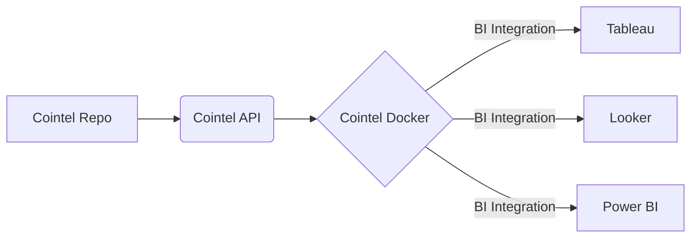

# Cointel's Technical Product Overview

# Products & Lifecycles
| Product | Description | Product Lifecycle |
|---|---|---|
| [cointel-api](https://cointel-api.herokuapp.com/__docs__/) | 💡 Cointel's Free Api | production |
| [cointel-app](https://github.com/cointelfinance/cointel-api) | ⏬ Cointel's App | beta |
| [request-cointel](https://github.com/cointelfinance/request) | ✅ Request a Cointel Account | production |

# Data as a Service Infrastructure

<!--
**cointelfinance/cointelfinance** is a ✨ _special_ ✨ repository because its `README.md` (this file) appears on your GitHub profile.

Here are some ideas to get you started:

- 🔭 I’m currently working on ...
- 🌱 I’m currently learning ...
- 👯 I’m looking to collaborate on ...
- 🤔 I’m looking for help with ...
- 💬 Ask me about ...
- 📫 How to reach me: ...
- 😄 Pronouns: ...
- ⚡ Fun fact: ...
-->
